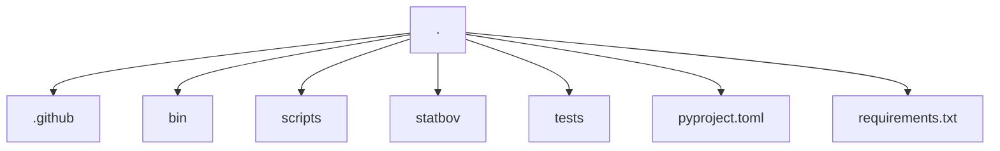
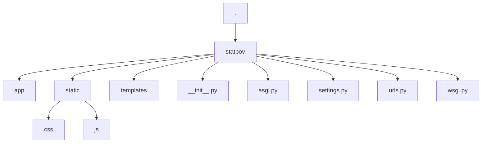
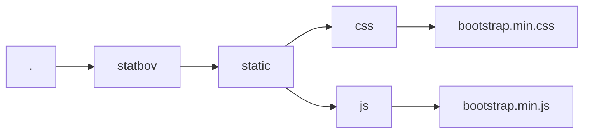
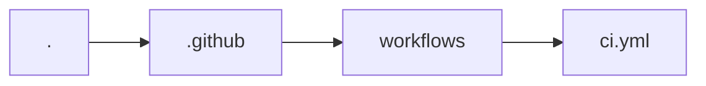
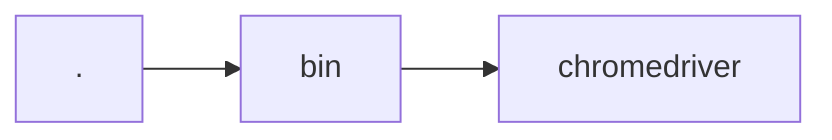
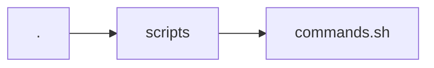

# Statbov

Statbov é um projeto para pecuária de precisão com análise de métricas.

## Executando localmente

Execute os seguintes comandos para executar o projeto localmente:

```bash
git clone https://github.com/henriquesebastiao/statbov.git
cd statbov
poetry install
poetry shell
```

Configure as variáveis de ambientes descritas na seção [Variáveis de ambiente](#variáveis-de-ambiente) e execute o Docker Compose:

```bash
docker-compose up -d
```

Agora você pode acessar o projeto em [http://localhost:8000](http://localhost:8000).

## Como o projeto está organizado?

**Estrutura de diretórios**



O projeto está dividido em dois diretórios principais:

- `statbov`: Contém o código-fonte do projeto.
- `tests`: Contém os testes do projeto.

### statbov



Todo o código-fonte do projeto está no diretório `statbov`. Sempre que for pertinente, a documentação de cada módulo, classe ou função será feita no próprio código seguindo o padrão de [docstrings do google](https://sphinxcontrib-napoleon.readthedocs.io/en/latest/example_google.html). Então, caso altere alguma coisa no código, lembre-se de atualizar também as docstrings (caso elas existam).

### Frontend

O frontend do projeto é feito com [Bootstrap](https://getbootstrap.com/docs/5.3/getting-started/introduction/), para ver se conseguimos fazer algo minimamente bonito haha. Os arquivos compilados e minificados `js` e `css` estão dentro do diretório `static` em suas respectivas pastas. 



### Testes

Para os testes estamos usando o [pytest](https://docs.pytest.org/). As configurações dele podem ser encontradas no arquivo [pyproject.toml](pyproject.toml) na raiz do nosso projeto.

A cobertura dos testes está sendo gerada automaticamente com [pytest-cov](https://github.com/pytest-dev/pytest-cov), sendo exibida quando a task de testes é executada:

```bash
task test
```

Sempre que você executar a `task test`, tres tarefas sao executadas:

- `pre_test`: Executa a `task lint` para verificar se o código está seguindo o padrão de estilo do projeto.
- `test`: Executa os testes.
- `post_test`: Gera o relatório de cobertura dos testes.

Cada uma destas tasks são explicadas em detalhes na seção [Tasks](#tasks).

### Ferramentas

Esse projeto basicamente usa duas ferramentas como base para todo com controle:

- [Poetry](https://python-poetry.org/): Para o gerenciamento do ambiente e instalação de bibliotecas;
- [Taskipy](https://github.com/illBeRoy/taskipy): Para automação de tarefas rotineiras. Como executar os testes, linters, etc.

Garanta que você tenha o Poetry instalado e devidamente configurado em sua máquina.

### Tasks

Aqui estão listadas as configurações de tasks do projeto, que você pode usar para executar tarefas corriqueiras. Como executar os testes, linters, etc.

Para executar uma task, basta executar o comando:

```bash
task <nome_da_task>
```

```toml
[tool.taskipy.tasks]
lint = "ruff . && blue --check . --diff && isort --check --diff ."
format = "blue .  && isort ."
run = "python manage.py runserver"
pre_test = "task lint"
test = "pytest -s -x --cov=statbov -vv"
post_test = "coverage run -m pytest && coverage html"
functional-test = 'pytest -m "functional_test"'
pre-commit = "python manage.py makemigrations && task test && task functional-test && task export-requirements"
export-requirements = "rm requirements.txt && poetry export -f requirements.txt --output requirements.txt --without-hashes --without dev"
```

#### export-requirements

Aqui vale um adendo. Mesmo utilizando o Poetry para gerenciar dependências, estamos exportando as dependências para o arquivo `requirements.txt`. Ele e necessário para gerar a imagem do Docker sem precisar instalar o poetry e suas dependências. Então, sempre que adicionar uma nova dependência, execute a task `export-requirements` para atualizar o arquivo `requirements.txt`.

### Outros diretórios importantes

#### .github



O diretório `.github` contém os arquivos de configuração do Github Actions. O arquivo `ci.yml` contém as configurações de CI/CD do projeto. Com ele, sempre que um commit for feito na branch `main`, o Github Actions irá executar os testes e linters verificando se está tudo OK.

#### bin



O diretório `bin` contém os binários necessários para executar os testes. No caso, o `chromedriver` para executar os testes funcionais.

#### scripts



O diretório `scripts` contém o script `commands.sh` que e responsável por executar o servidor Django no Docker. 

### Variáveis de ambiente

Para executar o projeto, você precisa criar um arquivo `.env` na raiz do projeto (ou configurá-las manualmente no seu ambiente) com as seguintes variáveis de ambiente:

```dotenv
SECRET_KEY="CHANGE-ME"

# 0 False, 1 True
DEBUG="1"

# Comma separated values
ALLOWED_HOSTS="127.0.0.1, localhost"

DB_ENGINE="django.db.backends.postgresql"
POSTGRES_DB="CHANGE-ME"
POSTGRES_USER="CHANGE-ME"
POSTGRES_PASSWORD="CHANGE-ME"
POSTGRES_HOST="CHANGE-ME"
POSTGRES_PORT="CHANGE-ME"
```
